# Documentation de l'Architecture
---
## Introduction et Objectifs
Ce document présente l'architecture d'un système de Point de Vente (POS) développé en Go. Le système est conçu pour gérer les opérations de vente et de retour de produits dans un environnement multi-caisses. L'architecture suit le modèle 4+1 de Philippe Kruchten, permettant une vue complète du système à travers différentes perspectives : logique, processus, déploiement, implémentation et cas d'utilisation.

Le système utilise une base de données PostgreSQL pour la persistance des données, avec GORM comme ORM pour faciliter les interactions avec la base de données. L'interface utilisateur est développée en utilisant BubbleTea, une bibliothèque populaire pour les applications terminal en Go. Le tout est conteneurisé avec Docker pour assurer une déploiement cohérent et reproductible.

## Contraintes
  #### Contraintes logicielles
  - L'interface utilisateur doit être en mode terminal
  - La base de données doit être PostgreSQL
  - Utilisation d'un ORM
  - L'application doit être conteneurisée avec Docker
  - Le système doit utiliser un système de logging pour tracer les opérations
  
  #### Besoins fonctionnels
  - Rechercher un produit (par identifiant, nom ou catégories) dans une liste de produit sur une base de donnée
  - Enregistrer une transaction (sélection de produits et calcul du total) dans une base de donnée, une
  - Enregistrer une transaction de retour de produit.
  - Consulter l'état du stock des produits mise à jours après les transactions
  
  #### Besoins non-fonctionnels
  - Performance et scalabilité
    - Le système doit supporter simultanément 3 caisses en opération
  - Sécurité
    - Journalisation(Logging) de toutes les transactions pour audit

## Contexte
Le système de Point de Vente (POS) est conçu pour fonctionner dans un contexte commercial, où plusieurs caisses peuvent opérer simultanément dans un même établissement. Chaque caisse est gérée par un caissier qui peut effectuer des ventes et des retours de produits. Le système maintient un inventaire centralisé des produits et enregistre toutes les transactions pour assurer la traçabilité des opérations.

Le contexte commercial implique des besoins spécifiques en termes de :
- Gestion simultanée de plusieurs points de vente
- Suivi en temps réel de l'inventaire
- Traçabilité des transactions
- Support des opérations de vente et de retour
- Interface utilisateur adaptée aux opérations de caisse

| Stakeholder | Rôle | Besoins |
|------------|------|---------|
| Caissier | Utilisateur principal | - Interface simple et intuitive - Gestion des ventes et retours - Accès rapide aux produits |
| Gestionnaire | Superviseur | - Suivi des transactions - Monitoring des stocks - Rapports de performance |
| Client | Utilisateur final | - Service rapide - Exactitude des transactions - Politique de retour claire |
| Administrateur système | Support technique | - Maintenance facile - Logs détaillés - Sécurité du système |

## Stratégie de Solution
#### Proposition d’architecture sous forme de vues UML selon le modèle 4+1
---
- Vue logique :

  | MDD                                 | Diagramme de classe Logiciel           |
  | ------------------------------------| ---------------------------------------|
  | 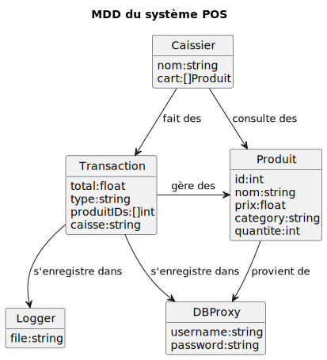|  |

- Vue des processus :

  | Diagramme de Séquences |  |  |
  | ----------------------------------------------------| --------------------------------------------------| -------------------------------------------------------|
  | 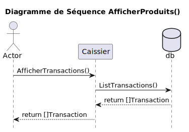| 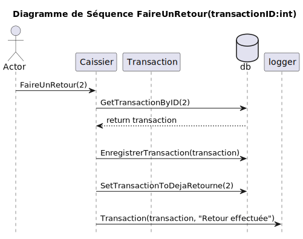 |       |
  | 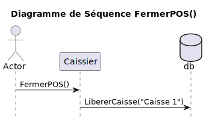       | 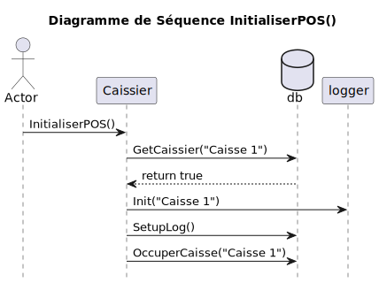| 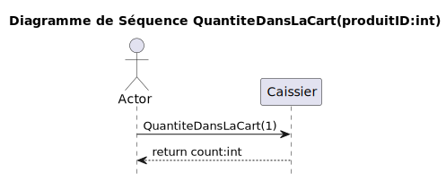 |
  | 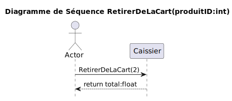 | 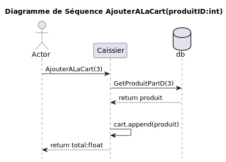|         |
  | 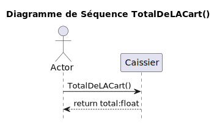 |  |  |

- Vue de déploiement :

  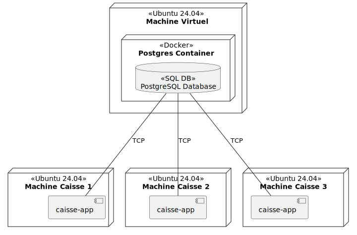

- Vue d’implémentation :
  
  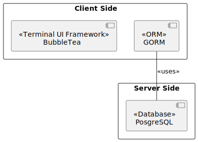

- Vue des cas d’utilisation :

  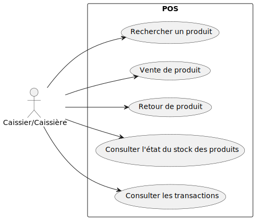

## Concepts Transversaux
#### Sécurité
- Authentification des caissiers
- Journalisation des transactions pour audit
- Protection des données sensibles
- Gestion des accès concurrents aux caisses

#### Performance
- Temps de réponse rapide pour les opérations de caisse
- Gestion efficace de la concurrence
- Optimisation des requêtes base de données
- Mise en cache des données fréquemment utilisées

#### Évolutivité
- Architecture modulaire permettant l'ajout de nouvelles fonctionnalités
- Support pour plusieurs points de vente
- Possibilité d'ajouter de nouveaux types de transactions
- Interface extensible pour l'ajout de nouveaux produits

#### Maintenabilité
- Code modulaire et bien structuré
- Documentation claire
- Tests automatisés
- Logs détaillés pour le débogage

#### Testabilité
- Tests unitaires
- Environnements de test isolés

## Décisions 

- J'ai choisi Go comme language pour ce projet, car j'aime ce language et je connais et qui est simple selon moi.
- J'ai choisi make comme build tool pour me facilité la vie, car je peux exectuter plusieurs commandes rapidement.
- J'ai choisi PosgreSQL car je trouve que c'est une base de donnée plus rapide et plus facile que MySQL, et est plus convenable à l'application que NoSQL.
- J'ai choisi GORM pour le ORM car c'est le meilleur pour go
- J'ai choisi BubbleTea pour mon ui du terminal car c'est le plus répendu et le mieux maintenu.
- J'ai choisi Docker car docker est mieux connue que les autres outils de conteneurs.

## Risques et Dette Technique
| Dette Technique | Description | Impact | Solution Proposée |
|----------------|-------------|---------|-------------------|
| Tests unitaires limités | Le projet manque de tests unitaires complets | Risque de bugs lors des modifications | Ajouter plus de tests unitaires |
| Documentation du code | La documentation du code est minimale pour le ui | Difficulté de maintenance | Ajouter des commentaires détaillés |
| Gestion des erreurs | La gestion des erreurs est basique | Risque de comportements inattendus | Améliorer la gestion des erreurs |

## Glossaire
| Terme | Définition |
|-------|------------|
| POS | Point of Sale - Système de caisse électronique |
| GORM | Go Object Relational Mapper - ORM pour Go |
| BubbleTea | Framework TUI (Terminal User Interface) pour Go |
| Docker | Plateforme de conteneurisation |
| PostgreSQL | Système de gestion de base de données relationnelle |
| Make | Outil d'automatisation de build |
| ORM | Object-Relational Mapping - Technique de programmation qui permet de convertir des données entre des systèmes incompatibles |
| TUI | Terminal User Interface - Interface utilisateur en mode texte |
| MDD | Modèle du Domaine - Représentation des concepts du domaine métier |
| UML | Unified Modeling Language - Langage de modélisation graphique |

