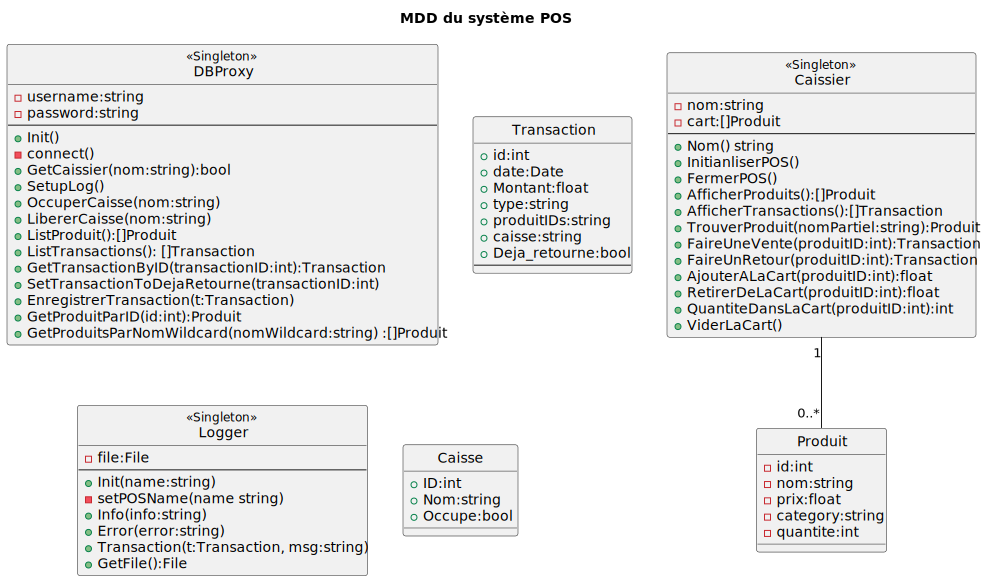
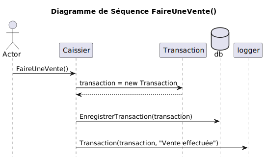
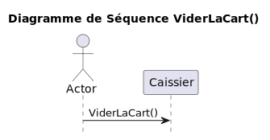

### Analyse des besoins fonctionnels et non-fonctionnels du système.
---
#### Besoins fonctionnels
- Rechercher un produit (par identifiant, nom ou catégories) dans une liste de produit sur une base de donnée
- Enregistrer une transaction (sélection de produits et calcul du total) dans une base de donnée, une
- Enregistrer une transaction de retour de produit.
- Consulter l'état du stock des produits mise à jours après les transactions
    

#### Besoins non-fonctionnels
- Performance et scalabilité
  - Le système doit supporter simultanément 3 caisses en opération

- Sécurité
  - Journalisation(Logging) de toutes les transactions pour audit

### Proposition d’architecture sous forme de vues UML selon le modèle 4+1
---
- Vue logique :

  | MDD                                 | Diagramme de classe                    |
  | ------------------------------------| ---------------------------------------|
  | |  |

- Vue des processus :

  | Diagramme de Séquences |  |  |
  | ----------------------------------------------------| --------------------------------------------------| -------------------------------------------------------|
  | |  |       |
  |        | |  |
  |  | |         |
  |  |  |  |

- Vue de déploiement :

  

- Vue d’implémentation :
  
  

- Vue des cas d’utilisation :

  

### Justification des décisions d’architecture (ADR)
- ADR Choix de la platform:
  - Titre : Choix de Native pour l'application de la caisse.
  - Status : Le choix de rendre l'apllication executable nativement est déjà implémenté.
  - Contexte : Je dois absolument choisir la platforme car c'est un logiciele utilisateur et les logiciel utilisateurs fonctionne sur une platforme en personne.
  - Décision : L'application va donc être executer nativement sur la machine.
  - Conséquences : Toute machine non fonctionnels doivent être maintenue en personne et non à distance.
  - Compliance : Ce choix n'affecte pas le finctionnement du système ni des autres caisses connecté.

- ADR Choix de mécanisme de base de donnée:
  - Titre : Choix d'une base de donnée PosgreSQL en serveur.
  - Status : Le choix de rendre d'une base de donnée PosgeSQL est déjà implémenté.
  - Contexte : Pour persisté les données à travers les caisses, il faut choisir une base de donnée externe.
  - Décision : Le système va donc utilié une base de donnée SQL en serveur.
  - Conséquences : Le système dépend de l'internet et doit utiliser SQL ou un ORM.
  - Compliance : Ce choix n'affecte pas le finctionnement du système ni des autres caisses connecté.
### Choix technologiques
- J'ai choisi Go comme language pour ce projet, car j'aime ce language et je veux en apprendre plus dessus.
- J'ai choisi make comme build tool pour me facilité la vie, car je peux exectuter plusieurs commandes rapidement.
- J'ai choisi PosgreSQL car je trouve que c'est une base de donnée plus rapide et plus facile que MySQL, et est plus convenable à l'application que NoSQL.
- J'ai choisi GORM pour le ORM car c'est le meilleur pour go
- J'ai choisi BubbleTea pour mon ui du terminal car c'est le plus répendu et le mieux maintenu.
- J'ai choisi Docker car docker est mieux connue que les autres outils de conteneurs.

